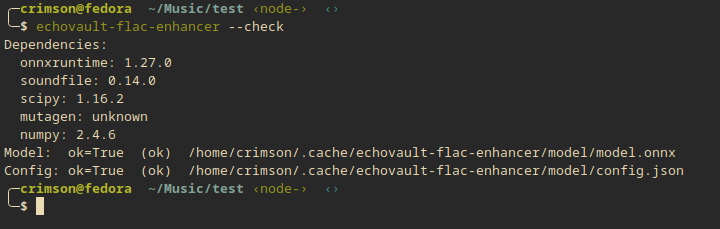
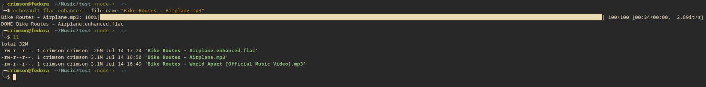
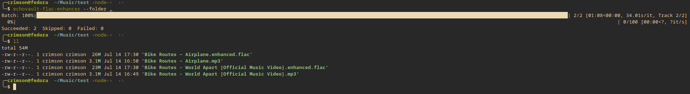

# echovault-flac-enhancer

Standalone CLI for bulk-enhancing lossy audio (MP3/AAC/OGG/WMA) to FLAC using
the same ONNX model EchoVault's desktop app uses, independent of Electron.

## Install

```bash
pip install echovault-flac-enhancer
```

## Usage

```bash
# One-time: download the model and verify everything works
echovault-flac-enhancer --setup

# Check runtime/deps/model status
echovault-flac-enhancer --check
```



```bash
# Enhance a single file
echovault-flac-enhancer --file-name path/to/track.mp3
```



```bash
# Enhance every lossy track in a folder
echovault-flac-enhancer --folder path/to/music [--recursive] [--skip-existing] [--output-dir DIR]
```



Outputs are written as `<original-stem>.enhanced.flac` alongside the source
(or under `--output-dir`, mirroring the source's relative subpath).

The model (~107MB) is cached at:

- Linux/macOS: `~/.cache/echovault-flac-enhancer/model/`
- Windows: `%LOCALAPPDATA%\echovault-flac-enhancer\model\`

## Development

```bash
git clone https://github.com/EchoVaultHQ/EchoVault-FLAC-Enhancer.git
cd EchoVault-FLAC-Enhancer
python -m venv .venv && source .venv/bin/activate
pip install -e .[dev]

ruff check .
black --check .
pytest -m "not slow"   # add -m slow to also run real network/model tests
```

## Non-goals (v1)

- No GUI — CLI only.
- No parallel/multi-worker inference (`--workers` must be `1`).
- No mid-batch resume — re-run with `--skip-existing` to pick up where a
  killed batch left off.
- `.m4a` files are not auto-globbed by `--folder` (ambiguous AAC vs. ALAC
  codec-in-container — pass an `.m4a` explicitly via `--file-name` if you're
  sure it's lossy AAC).

## Releasing

### Model assets (once per model version)

Before `--setup` works for end users, a maintainer must create a GitHub
Release on this repo and upload `model.onnx` + `config.json` as release
assets, matching the URL/hashes pinned in
`echovault_flac_enhancer/data/manifest.json`. Verify locally before
uploading:

```bash
sha256sum model.onnx config.json   # compare against manifest.json's sha256/bytes
```

If the release tag doesn't match `manifest.json`'s `baseUrl`, update
`baseUrl` and commit — every installed CLI resolves the download from
that field.

### Package (PyPI)

Publishing is handled by `.github/workflows/publish.yml` via PyPI
Trusted Publishing (OIDC — no stored token), tied to the `pypi`
GitHub Actions environment.

- **Normal path**: bump the version in `pyproject.toml` and
  `CHANGELOG.md`, commit, then publish a GitHub Release for that tag.
  The `release: published` event triggers the workflow automatically.
- **One-off / manual path**: Actions tab → **Publish** workflow →
  **Run workflow** → branch `main`. Useful when the version has no
  release of its own yet (e.g. it already shares a tag with a
  model-asset release).
